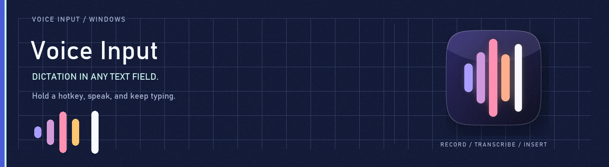
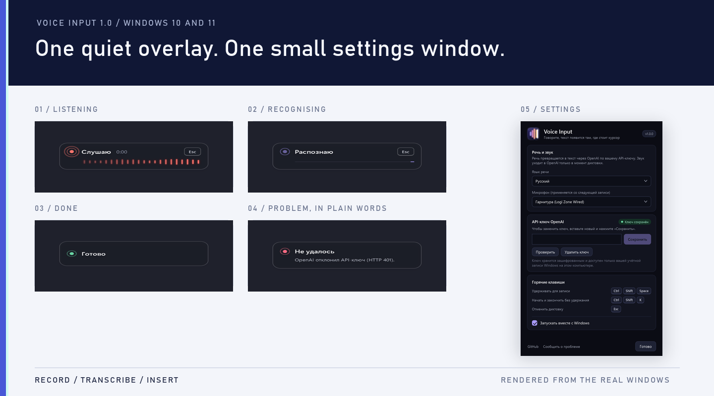

<p align="center">
  
</p>

# Voice Input

Приложение для Windows в системном трее: удерживайте горячую клавишу, говорите, отпустите — расшифрованный текст появится в активном поле ввода.

<p align="center">
  <a href="https://github.com/pavel-logachev/voice-input/releases/latest">Скачать</a>
  &nbsp;·&nbsp;
  <a href="CHANGELOG.md">Что нового</a>
  &nbsp;·&nbsp;
  <a href="docs/ARCHITECTURE.md">Архитектура</a>
  &nbsp;·&nbsp;
  <a href="#приватность">Приватность</a>
  &nbsp;·&nbsp;
  <a href="#проверка">Проверка</a>
</p>

<p align="center"><a href="https://github.com/pavel-logachev/voice-input/releases/latest"><strong>v1.0.0</strong></a> &nbsp;·&nbsp; <a href="https://github.com/pavel-logachev/voice-input/actions/workflows/ci.yml">CI</a> &nbsp;·&nbsp; Windows 10/11 x64 &nbsp;·&nbsp; <a href="LICENSE">MIT</a></p>

<p align="center">
  
</p>

## Как это работает

```text
Ctrl+Shift+Space down
  → запоминается окно, где стоит курсор
  → WASAPI-запись в память (mono 16 kHz)
  → Ctrl+Shift+Space up
  → расшифровка через OpenAI (ваш API-ключ)
  → вставка в исходное окно: напрямую или через защищённую вставку из буфера
```

Распознавание выполняет OpenAI: приложению нужны интернет и ваш собственный API-ключ. Ключ вводится в окне настроек и хранится зашифрованным, доступным только вашей учётной записи Windows. Стоимость запросов списывается с вашего аккаунта OpenAI.

## Что умеет

- **Удерживайте `Ctrl + Shift + Space`**, говорите, отпустите. Или нажмите **`Ctrl + Shift + K`**, чтобы начать запись без удержания, и ещё раз, чтобы закончить.
- **`Esc` отменяет** активную диктовку: текст не вставляется, поздний ответ распознавания отбрасывается.
- **Маленький оверлей** над панелью задач, не забирающий фокус: плавно появляется и исчезает, индикатор «дышит» и посылает кольцо при записи, рядом идёт таймер, полосы повторяют уровень голоса и затухают, подсказка `Esc` в виде клавиши. Цвет показывает этап: запись, распознавание, вставка, готово. Работает и в режиме высокой контрастности.
- **Окно настроек** (двойной клик по значку в трее): ввод, проверка и удаление API-ключа, язык речи, **выбор микрофона**, автозапуск с Windows. Микрофон можно сменить и прямо из меню трея.
- **Понятные сообщения**: неверный ключ, исчерпанный баланс, нет сети, недоступный сервис. Каждая проблема описана словами.
- **Занятая горячая клавиша не ломает запуск**: приложение работает с оставшимся сочетанием и сообщает, какое занято.
- **Запись до 10 минут**; если микрофон отключили или лимит достигнут, запись останавливается сама и текст не теряется.
- **Безопасная вставка**: прямая вставка в стандартные поля, для остальных — через буфер обмена; буфер восстанавливается, только если его не изменили. Если окно сменилось во время диктовки, вставка отменяется.
- Второй экземпляр не запускается.

## Установка

1. Откройте [последний релиз](https://github.com/pavel-logachev/voice-input/releases/latest) и скачайте `VoiceInput-Setup-1.0.0.exe`.
2. Запустите установщик. Права администратора не нужны. Windows SmartScreen может предупредить о неподписанном издателе, установщик пока не подписан сертификатом.
3. При первом запуске откроется окно настроек. Вставьте API-ключ OpenAI (начинается с `sk-`) и нажмите «Сохранить».
4. Поставьте курсор в любое поле ввода и зажмите `Ctrl + Shift + Space`.

Обновление с 0.9.x выполняется поверх: ключ и настройки сохраняются. Удаление программы удаляет и ключ.

## Приватность

- Запись живёт только в памяти текущей сессии и на диск не сохраняется.
- **Звук отправляется в OpenAI** для расшифровки, и только в момент диктовки. Условия обработки определяет ваш договор с OpenAI.
- Ключ хранится в `%LOCALAPPDATA%\VoiceInput\secrets`, зашифрован через Windows DPAPI для вашей учётной записи; наружу уходит только как заголовок авторизации запроса к OpenAI.
- История расшифровок не ведётся. Приложение не собирает телеметрию.
- Диагностический файл включается только переменной `VOICE_INPUT_DIAGNOSTIC_LOG` и не содержит ни звука, ни текста.

## Запуск из исходников

Требования: Windows 10/11 x64 и .NET 10 SDK.

```bash
dotnet run --project src/VoiceInput.App -c Release
```

В сборке из исходников рядом с приложением лежит необязательный рабочий процесс локального распознавания (`VoiceInput.Asr.Worker`, GigaAM): в настройках появляется выбор «На этом компьютере». Он работает офлайн, но при первом включении загружает около 200 МБ (runtime и модель с проверкой SHA-256). В установщик 1.0 локальный движок не входит.

Переменные для тестов и параллельных запусков: `VOICE_INPUT_DATA_DIR` (папка настроек и ключа), `VOICE_INPUT_INSTANCE_NAME` (имя защиты от второго экземпляра), `VOICE_INPUT_DIAGNOSTIC_LOG`.

## Проверка

```bash
dotnet build VoiceInput.sln -c Release
dotnet test VoiceInput.sln -c Release --no-build
```

Тесты покрывают рабочий процесс диктовки, отмену и гонки, запись звука на фиктивном устройстве, клиент OpenAI на подставном сервере, хранение ключа и настроек, автозапуск, горячие клавиши, вставку текста и внешний вид окон.

Настоящие окна можно отрисовать в PNG без записи речи (так сделаны картинки в этом README):

```bash
dotnet run --project tests/VoiceInput.UiPreview -c Release -- preview
```

## Ограничения

- Нужны интернет и ключ OpenAI; офлайн-режима в установщике нет.
- Горячие клавиши фиксированы.
- Приложения, запущенные от администратора, блокируют вставку из обычного процесса.
- Нет автообновления и подписи кода.

## Документы

- [Что нового](CHANGELOG.md)
- [Архитектура](docs/ARCHITECTURE.md)
- [Принципы знака Quiet Pulse](docs/ICON_DESIGN.md)
- [Исследование локальных ASR-моделей](docs/MODEL_RESEARCH.md) (история: 0.x-версии работали офлайн)

## Лицензия

[MIT](LICENSE). Используемые компоненты: [THIRD_PARTY_NOTICES.md](THIRD_PARTY_NOTICES.md).
