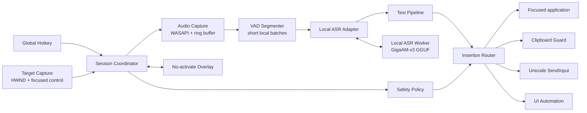

# Voice Input — архитектурное видение

**Статус:** draft 0.2 — local-first  
**Целевая платформа:** Windows 10/11  
**Суть:** резидентное приложение, которое по глобальной горячей клавише записывает речь, расшифровывает её и вставляет результат в то поле, где находился курсор.

## 1. Продуктовая модель

Это не отдельный текстовый редактор и не «чат с микрофоном». Приложение должно ощущаться как системная функция:

1. курсор уже стоит в нужном поле;
2. пользователь удерживает или нажимает горячую клавишу;
3. появляется маленький **неактивирующийся overlay**, но фокус остаётся в исходном приложении;
4. речь распознаётся локально; длинная диктовка заранее режется по естественным паузам;
5. после отпускания клавиши финальный текст появляется у курсора;
6. `Esc` отменяет сессию, ничего не вставляя.

Главный критерий качества — не максимальное число AI-функций, а предсказуемость: вызов срабатывает всегда, фокус не теряется, буфер обмена не портится, текст не переписывается без разрешения.

## 2. Главное техническое решение

### Нативное Windows-приложение и изолированный local-ASR worker

Предлагаемый стек:

- **C# + актуальный .NET LTS**;
- **WPF** только для tray/settings/overlay;
- прямые Windows API для `WH_KEYBOARD_LL`, foreground/focus, `SendInput`, clipboard и UI Automation;
- **WASAPI** через тонкую обёртку (вероятно NAudio) для захвата микрофона;
- **GigaAM-v3 E2E RNNT** в GGUF через `transcribe.cpp` как основной local-ASR кандидат;
- отдельный долгоживущий native worker, связанный с приложением через named pipe;
- встроенный DI/host, structured logging и state machine;
- без Electron, локального web-сервера и внешнего backend.

Почему так:

- основная сложность здесь — Windows integration, а не интерфейс;
- C# даёт зрелый доступ к Win32, UI Automation, аудио и системному tray;
- системная оболочка остаётся небольшим управляемым .NET-процессом;
- native inference изолирован: сбой GGUF/Vulkan backend не должен уронить hotkey, tray и настройки;
- аудио не покидает компьютер, нет API-ключа и зависимости от сети;
- детали выбора модели и опубликованные бенчмарки зафиксированы в [MODEL_RESEARCH.md](MODEL_RESEARCH.md).

## 3. Состав системы



### 3.1 `HotkeyService`

- Глобально отслеживает нажатие и отпускание комбинации.
- Поддерживает два режима: **hold-to-talk** и **toggle**.
- Для hold-to-talk нужен low-level keyboard hook: обычного `RegisterHotKey` недостаточно для надёжного события отпускания.
- По умолчанию не перехватывает обычный ввод и подавляет только явно назначенную комбинацию.

### 3.2 `TargetCapture`

В момент начала диктовки фиксирует:

- foreground `HWND` и process id;
- UI Automation element под фокусом, если доступен;
- признак password/secure field;
- уровень целостности целевого процесса;
- минимальные метаданные приложения для выбора профиля вставки.

Содержимое окна приложение по умолчанию не читает. Overlay создаётся с `WS_EX_NOACTIVATE`, поэтому не должен забирать фокус.

### 3.3 `SessionCoordinator`

Единая state machine:

```text
Idle → Arming → Recording → Finalizing → Inserting → Idle
                   ↘ Cancelled / Failed ↗
```

Она сериализует сессии и не позволяет повторному hotkey, смене микрофона или запоздалому ответу ASR вставить текст не в то окно.

У каждой сессии есть immutable `session_id`, target snapshot, timestamps и cancellation token.

### 3.4 `AudioCapture`

- захват mono PCM через WASAPI;
- небольшой ring buffer, чтобы не потерять первые слоги после нажатия;
- resample в 16 kHz mono PCM для local runtime;
- VAD закрывает сегмент только на уверенной естественной паузе и не должен обрезать тихую речь;
- сегменты ограничиваются примерно 15–20 секундами, чтобы оставаться внутри short-form лимита модели;
- закрытые сегменты можно распознавать, пока пользователь продолжает говорить;
- аудио хранится только в памяти и не пишется на диск.

### 3.5 `LocalTranscriptionProvider`

Runtime скрыт за контрактом с явными capabilities:

```csharp
public interface ITranscriptionProvider
{
    TranscriptionCapabilities Capabilities { get; }

    Task<TranscriptSegment> TranscribeAsync(
        AudioSegment segment,
        TranscriptionOptions options,
        CancellationToken cancellationToken);
}
```

Provider возвращает сегмент текста, word/token timestamps при наличии, ошибки и latency metrics. `SupportsPartial` не предполагается: первый кандидат GigaAM-v3 E2E RNNT работает short-form, а не как настоящая streaming-модель.

На старте реализуется **один** хорошо проверенный local runtime: GigaAM-v3 E2E RNNT Q4_K_M через `transcribe.cpp`. E2E CTC и Russian Whisper Turbo служат benchmark challengers, а не одновременно поставляемыми backends. Worker загружает модель один раз, прогревает CPU backend и перезапускается оболочкой при падении. CPU — безопасный default; Vulkan на AMD включается только если локальный warm benchmark подтверждает выигрыш.

### 3.6 `TextPipeline`

Два принципиально раздельных режима:

1. **Verbatim** — E2E-вывод модели плюс детерминированная сборка сегментов и нормализация пробелов.
2. **Polish** — опциональная отдельная обработка текста; UI всегда показывает, что формулировка может измениться.

В MVP основной режим — `Verbatim`. LLM не должен быть обязательным звеном: он повышает задержку и может менять смысл.

Позже сюда можно добавить:

- пользовательский словарь и замены;
- команды «новая строка», «запятая», «отмени»;
- профили по приложению: мессенджер, код, письмо;
- автоматический выбор языка без перевода текста.

### 3.7 `InsertionRouter`

Самая важная часть после качества распознавания. Единственного универсального способа вставить текст во все Windows-приложения нет, поэтому нужен маршрутизатор стратегий.

Предварительный порядок:

1. **Unicode `SendInput`** — не трогает clipboard, хорош для короткого обычного текста.
2. **Clipboard + paste** — быстрый основной путь для длинного текста, Chromium/Electron и сложных редакторов.
3. **UI Automation adapter** — адресные обходы для контролов, где это действительно надёжнее.

`ClipboardGuard`:

- захватывает clipboard sequence number;
- временно помещает plain text;
- посылает paste в сохранённое целевое окно;
- восстанавливает прежний clipboard только если пользователь или другое приложение не успели изменить его после нашей операции;
- не пытается слепо восстанавливать гигантские/отложенные форматы.

Маршрутизатор хранит capability profile по типу приложения и логирует выбранный путь без содержимого диктовки.

### 3.8 `Overlay`

- маленькое окно у нижней части экрана или рядом с caret;
- состояния: listening, transcribing, inserting, error;
- waveform/уровень и длительность; предварительный текст появляется только если runtime действительно поддерживает надёжные partials;
- `WS_EX_NOACTIVATE`, topmost только на время сессии;
- не принимает клавиатурный фокус;
- ошибки короткие и операционные: «нет микрофона», «поле защищено», «цель запущена от администратора».

## 4. Безопасность и приватность

- запись начинается только после hotkey и имеет заметную индикацию;
- запись прекращается гарантированно при отпускании, `Esc`, блокировке Windows и смене аудиоустройства;
- в password/secure fields вставка блокируется;
- аудио не сохраняется и не отправляется по сети;
- история расшифровок **выключена по умолчанию**;
- диагностические логи не содержат аудио и текст;
- модель загружается только по pinned manifest с проверкой checksum;
- аналитика и crash reporting — только opt-in.

Отдельное ограничение Windows: обычный процесс не может надёжно посылать ввод в elevated-приложение из-за UIPI. В MVP мы честно показываем это как границу. Не стоит запускать всё приложение от администратора. Если кейс окажется важным, позже можно проектировать подписанный `uiAccess`/broker-вариант отдельно.

## 5. Хранение состояния

Для MVP:

- обычные настройки — versioned JSON в `%LocalAppData%`;
- manifest модели и выбранный inference backend — versioned settings;
- словарь и профили — локальная SQLite только когда они появятся;
- история — отдельная opt-in таблица с понятной кнопкой полного удаления;
- никакой серверной учётной записи для личной версии.

## 6. Надёжность

Обязательные защитные механизмы:

- одна активная session state machine;
- cancellation на каждом I/O-этапе;
- deadline для finalize ASR и вставки;
- защита от ответа старой сессии после запуска новой;
- фиксация target до появления overlay;
- обнаружение смены foreground window перед вставкой: либо вставить в исходную цель, либо потребовать повторного действия — никогда не угадывать;
- graceful degradation при пропавшем микрофоне или перезапуске local worker;
- watchdog worker-процесса и один контролируемый restart без поздней вставки старого результата;
- локальная очередь не нужна: устаревшая диктовка не должна неожиданно вставляться позже.

## 7. Структура solution

```text
VoiceInput.sln
src/
  VoiceInput.App/             # WPF tray, settings, bootstrap
  VoiceInput.Core/            # state machine, domain contracts, policies
  VoiceInput.Windows/         # hotkeys, HWND/focus, overlay, clipboard, SendInput, UIA
  VoiceInput.Audio/           # WASAPI capture, framing, resampling
  VoiceInput.Transcription/   # provider contracts, VAD segments, text assembly
  VoiceInput.LocalInference/  # named-pipe client and worker supervision
  VoiceInput.Storage/         # settings, model manifest, optional history
  VoiceInput.Diagnostics/     # redacted logs and metrics

native/
  transcribe-worker/          # transcribe.cpp host, GGUF, CPU/Vulkan

tests/
  VoiceInput.Core.Tests/
  VoiceInput.Windows.Tests/
  VoiceInput.Transcription.Tests/
  VoiceInput.E2E.Harness/     # test controls + fake ASR

docs/
```

Большинство границ остаются логическими внутри .NET-приложения. Единственная намеренная process boundary — native ASR worker: она изолирует падения runtime и позволяет независимо перезапускать/обновлять модель.

## 8. План MVP — вертикальными срезами

### Slice A — доказать системную интеграцию

- tray process;
- глобальный hold-to-talk hotkey;
- no-activate overlay;
- сохранение target;
- вставка заранее заданного текста;
- проверка в Notepad, браузере/contenteditable, VS Code, мессенджере и Office-подобном редакторе.

**Критерий:** фокус и clipboard остаются корректными, текст стабильно попадает к курсору.

### Slice B — настоящая диктовка

- WASAPI capture;
- VAD-сегментация без потери тихой речи;
- GigaAM-v3 E2E RNNT Q4 через local worker;
- сборка коротких сегментов в один финальный transcript;
- benchmark E2E RNNT против E2E CTC и Russian Whisper Turbo;
- русский и mixed RU/EN как отдельные quality-срезы;
- cancel/error/retry semantics;
- latency metrics.

**Критерий:** от отпускания клавиши до вставки финального текста — субъективно мгновенно на обычной фразе; точные бюджеты установим по реальным измерениям.

### Slice C — продуктовая оболочка

- settings и выбор микрофона/hotkey;
- словарь;
- autostart;
- model manager с pinned version/checksum;
- installer, code signing и update channel;
- privacy controls и redacted diagnostics.

## 9. Как будем проверять

Не только unit-тестами:

- fake ASR для воспроизводимых E2E-сценариев;
- тестовое окно с Win32, WPF, WebView/contenteditable и многострочными контролами;
- replay-набор реальных аудиофраз без обращения к микрофону;
- matrix ручной проверки: Notepad, Chrome/Edge, VS Code, Telegram/Slack-подобный клиент, Word/Outlook-подобный редактор, terminal;
- измерения: hotkey-to-recording, segment-close-to-text, hotkey-up-to-final, final-to-insert, peak RAM и error rate вставки;
- отдельные тесты clipboard race, смены фокуса, падения worker и медленного локального inference.

## 10. Что намеренно не входит в первый MVP

- кроссплатформенность;
- cloud backend, серверные аккаунты и синхронизация;
- постоянная запись или wake word;
- сложный AI-редактор;
- командная синхронизация словарей;
- обход защищённых/elevated окон.

## 11. Первые решения перед кодом

Перед Slice A достаточно согласовать четыре вещи:

1. что именно раздражает в OpenWhispr — UX, задержка, качество, вставка, приватность или нестабильность;
2. семантика hotkey: удержание, переключатель или оба режима;
3. достаточно ли в первом MVP компактного индикатора без псевдостримингового partial transcript;
4. какие 5–7 приложений составят обязательную матрицу совместимости.

Архитектурно я бы начал именно с **надежной вставки и сохранения фокуса**, используя fake transcript. Подключать ASR до доказательства этого пути — значит оптимизировать не самую рискованную часть продукта.
