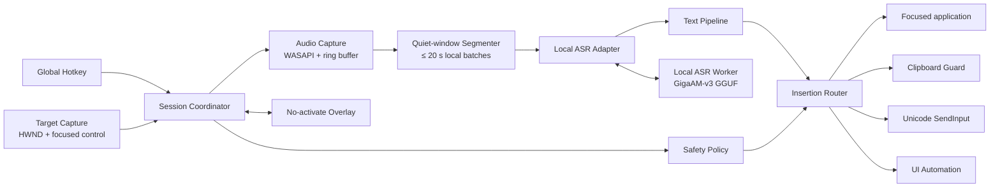

# Voice Input — архитектурное видение

**Статус:** 0.5 — installable local-first MVP; документ совмещает текущую реализацию и целевую архитектуру
**Целевая платформа:** Windows 10/11  
**Суть:** резидентное приложение, которое по глобальной горячей клавише записывает речь, расшифровывает её и вставляет результат в то поле, где находился курсор.

## 1. Продуктовая модель

Это не отдельный текстовый редактор и не «чат с микрофоном». Приложение должно ощущаться как системная функция:

1. курсор уже стоит в нужном поле;
2. пользователь удерживает или нажимает горячую клавишу;
3. появляется маленький **неактивирующийся overlay**, но фокус остаётся в исходном приложении;
4. речь распознаётся локально; длинная диктовка режется в памяти на short-form сегменты;
5. после отпускания клавиши финальный текст появляется у курсора;
6. `Esc` отменяет активную сессию, ничего не вставляя.

Главный критерий качества — не максимальное число AI-функций, а предсказуемость: вызов срабатывает всегда, фокус не теряется, буфер обмена не портится, текст не переписывается без разрешения.

### Реализовано на 2026-07-28

- `Ctrl + Shift + Space` запускает hold-to-talk с сохранением foreground `HWND`;
- `Ctrl + Shift + K` запускает универсальный toggle-to-talk; если клавиатура поддерживает переназначение клавиш, на это сочетание можно настроить удобную дополнительную кнопку;
- WPF overlay использует `WS_EX_NOACTIVATE`, 85% Acrylic backdrop на Windows 11 и tint-only fallback на Windows 10, при High Contrast, отключённой прозрачности или недоступном compositor;
- NAudio/WASAPI записывает default microphone и преобразует поток в mono float32 16 kHz;
- quiet-window segmenter режет итоговую запись на фрагменты до 20 секунд;
- отдельный .NET worker через P/Invoke загружает `transcribe.cpp 0.1.3` и GigaAM-v3 E2E RNNT Q4;
- приложение и worker общаются через named pipe;
- runtime и модель автоматически загружаются по pinned URL и проверяются по SHA-256;
- CPU backend подтверждён on-device тестом и выбран default;
- native Edit/RichEdit получают текст через `EM_REPLACESEL`, остальные контролы — через guarded clipboard paste;
- foreground перепроверяется непосредственно перед вставкой, а новый clipboard пользователя никогда не затирается старым snapshot;
- self-contained Windows installer включает приложение, worker, .NET runtime, native ASR runtime и модель.
- executable, tray и installer используют единый multi-size знак Quiet Pulse.

Пока не реализованы: password/UIA detection, отдельный UIA insertion adapter, выбор микрофона, worker watchdog/restart, автообновление и code signing.

## 2. Главное техническое решение

### Нативное Windows-приложение и изолированный local-ASR worker

Предлагаемый стек:

- **C# + .NET 10**;
- **WPF** только для tray/settings/overlay;
- прямые Windows API для `RegisterHotKey`, foreground/focus, native text controls и paste; UI Automation остаётся следующим insertion-срезом;
- **WASAPI через NAudio 2.2.1** для захвата микрофона;
- **GigaAM-v3 E2E RNNT** в GGUF через `transcribe.cpp` как основной local-ASR кандидат;
- отдельный долгоживущий native worker, связанный с приложением через named pipe;
- встроенный DI/host, structured logging и state machine;
- без Electron, локального web-сервера и внешнего backend.

Почему так:

- основная сложность здесь — Windows integration, а не интерфейс;
- C# даёт зрелый доступ к Win32, UI Automation, аудио и системному tray;
- системная оболочка остаётся небольшим управляемым .NET-процессом;
- native inference изолирован: сбой GGUF/Vulkan backend не должен уронить hotkey, tray и настройки;
- аудио не покидает компьютер, нет API-ключа и зависимости от сети;
- детали выбора модели и опубликованные бенчмарки зафиксированы в [MODEL_RESEARCH.md](MODEL_RESEARCH.md).

## 3. Состав системы



### 3.1 `HotkeyService`

- Глобально получает нажатие комбинации через `RegisterHotKey`.
- Текущий **hold-to-talk** начинает запись по `WM_HOTKEY`, а отпускание отслеживает коротким polling `GetAsyncKeyState`.
- Отдельный `Ctrl + Shift + K` использует manual release gate: первый `WM_HOTKEY` начинает запись, второй завершает её.
- Low-level hook или Raw Input остаются вариантом, если polling покажет пропуски или понадобится произвольное переназначение.
- По умолчанию не перехватывает обычный ввод и подавляет только явно назначенную комбинацию.

### 3.2 `TargetCapture`

Целевая версия в момент начала диктовки фиксирует:

- foreground `HWND` и process id;
- UI Automation element под фокусом, если доступен;
- признак password/secure field;
- уровень целостности целевого процесса;
- минимальные метаданные приложения для выбора профиля вставки.

Текущий MVP фиксирует foreground `HWND` и process id. Содержимое окна приложение не читает. Overlay создаётся с `WS_EX_NOACTIVATE`, поэтому не должен забирать фокус.

### 3.3 `SessionCoordinator`

Единая state machine:

```text
Idle → Recording → Processing → Inserting → Idle
                   ↘ Cancelled / Failed ↗
```

Она сериализует сессии и не позволяет повторному hotkey, смене микрофона или запоздалому ответу ASR вставить текст не в то окно.

У каждой сессии есть immutable `session_id`, target snapshot, timestamps и cancellation token.

### 3.4 `AudioCapture`

- захват mono PCM через WASAPI;
- resample в 16 kHz mono float32 PCM для local runtime;
- текущий quiet-window segmenter после окончания записи ищет самые тихие 200-мс окна перед 20-секундным лимитом;
- online VAD, pre-roll ring buffer и параллельное распознавание закрытых сегментов остаются latency-оптимизациями;
- аудио хранится только в памяти и не пишется на диск.

### 3.5 `LocalTranscriptionProvider`

Runtime скрыт за компактным контрактом:

```csharp
public interface ITranscriber
{
    ValueTask<string> TranscribeAsync(
        RecordedAudio audio,
        CancellationToken cancellationToken);
}
```

`SegmentingTranscriber` делит запись, отправляет float32-сегменты worker-процессу и соединяет непустые ответы. Word/token timestamps и capabilities можно добавить, не меняя системный hotkey/audio/insertion путь.

Реализован **один** local runtime: GigaAM-v3 E2E RNNT Q4_K_M через `transcribe.cpp 0.1.3`. E2E CTC и Russian Whisper Turbo служат benchmark challengers, а не одновременно поставляемыми backends. Worker загружает модель один раз; watchdog/restart ещё предстоит добавить. CPU выбран default после локального warm benchmark, где он оказался быстрее Vulkan на встроенной AMD Graphics.

### 3.6 `TextPipeline`

Два принципиально раздельных режима:

1. **Verbatim** — E2E-вывод модели плюс детерминированная сборка сегментов и нормализация пробелов.
2. **Polish** — опциональная отдельная обработка текста; UI всегда показывает, что формулировка может измениться.

В MVP основной режим — `Verbatim`. LLM не должен быть обязательным звеном: он повышает задержку и может менять смысл.

Позже сюда можно добавить:

- пользовательский словарь и замены;
- команды «новая строка», «запятая», «отмени»;
- профили по приложению: мессенджер, код, письмо;
- автоматический выбор языка без перевода текста.

### 3.7 `InsertionRouter`

Самая важная часть после качества распознавания. Единственного универсального способа вставить текст во все Windows-приложения нет, поэтому нужен маршрутизатор стратегий.

Текущий порядок:

1. **Native Edit/RichEdit** — `EM_REPLACESEL` вставляет в текущую selection без изменения clipboard.
2. **Guarded clipboard + paste** — основной fallback для Chromium/Electron, WPF и сложных редакторов.
3. **UI Automation adapter** — адресные обходы для контролов, где это действительно надёжнее.

`ClipboardGuard`:

- создаёт snapshot доступных clipboard-форматов;
- временно помещает plain text;
- посылает paste в сохранённое целевое окно;
- помечает временный clipboard private registered format;
- восстанавливает snapshot только если marker всё ещё присутствует — новый clipboard пользователя не перезаписывается.

Маршрутизатор хранит capability profile по типу приложения и логирует выбранный путь без содержимого диктовки.

### 3.8 `Overlay`

- компактная карточка `200×64` logical pixels над taskbar без лишнего текста и пустого пространства;
- background Acrylic размывает только содержимое рабочего стола за карточкой; текст и индикаторы остаются резкими, а 85% тёмный tint сохраняет контраст;
- при High Contrast, отключённых системных эффектах, недоступном DWM composition или ошибке native backdrop API используется обычная тёмная подложка `#D914171C`;
- пользовательские состояния: «Слушаю» с meter и «Распознаю» с короткой progress-анимацией; название модели и backend в overlay не показываются;
- live-индикатор получает только нормализованный RMS из текущего WASAPI-потока: при тишине показывает ровную линию, при речи — историю движущихся полос;
- обновление WPF выполняется вне audio callback; отдельный capture не запускается, PCM для визуализации не сохраняется;
- длительность и предварительный текст можно добавить позднее; partial text появляется только если runtime действительно поддерживает надёжные partials;
- `WS_EX_NOACTIVATE`, topmost только на время сессии;
- не принимает клавиатурный фокус;
- ошибки короткие и операционные: «нет микрофона», «поле защищено», «цель запущена от администратора».

## 4. Безопасность и приватность

- запись начинается только после hotkey и имеет заметную индикацию;
- текущая запись прекращается при отпускании hotkey; `Esc`, блокировка Windows и смена устройства должны стать дополнительными cancellation-триггерами;
- блокировка вставки в password/secure fields запланирована вместе с UI Automation target capture;
- аудио не сохраняется и не отправляется по сети;
- история расшифровок **выключена по умолчанию**;
- диагностические логи не содержат аудио и текст;
- модель загружается только по pinned manifest с проверкой checksum;
- аналитика и crash reporting — только opt-in.

Отдельное ограничение Windows: обычный процесс не может надёжно посылать ввод в elevated-приложение из-за UIPI. В MVP мы честно показываем это как границу. Не стоит запускать всё приложение от администратора. Если кейс окажется важным, позже можно проектировать подписанный `uiAccess`/broker-вариант отдельно.

## 5. Хранение состояния

Целевое локальное хранение:

- runtime, модель и download cache уже размещаются в `%LocalAppData%\VoiceInput`;
- обычные настройки и manifest выбранного backend позднее будут храниться как versioned JSON;
- словарь и профили — локальная SQLite только когда они появятся;
- история — отдельная opt-in таблица с понятной кнопкой полного удаления;
- никакой серверной учётной записи для личной версии.

## 6. Надёжность

Обязательные защитные механизмы целевой версии (state serialization, target capture и focus recheck уже реализованы; остальное остаётся roadmap):

- одна активная session state machine;
- cancellation на каждом I/O-этапе;
- deadline для finalize ASR и вставки;
- защита от ответа старой сессии после запуска новой;
- фиксация target до появления overlay;
- обнаружение смены foreground window перед вставкой: либо вставить в исходную цель, либо потребовать повторного действия — никогда не угадывать;
- graceful degradation при пропавшем микрофоне или перезапуске local worker;
- watchdog worker-процесса и один контролируемый restart без поздней вставки старого результата;
- локальная очередь не нужна: устаревшая диктовка не должна неожиданно вставляться позже.

## 7. Структура solution

```text
VoiceInput.sln
src/
  VoiceInput.App/             # WPF tray, overlay, bootstrap, worker packaging
  VoiceInput.Asr.Worker/      # изолированный .NET host для native transcribe.cpp
  VoiceInput.Core/            # state machine, domain contracts, policies
  VoiceInput.Windows/         # WASAPI, hotkey/focus/SendInput, provisioner, named-pipe client

tests/
  VoiceInput.Core.Tests/
  VoiceInput.Windows.Tests/
  VoiceInput.E2E.Harness/     # реальная global-hotkey/foreground/SendInput проверка
  VoiceInput.Audio.E2E/       # реальный default microphone без сохранения аудио
  VoiceInput.Asr.E2E/         # production workflow с PCM fixture и настоящим GigaAM worker

docs/
```

Большинство границ остаются логическими внутри .NET-приложения. Единственная намеренная process boundary — native ASR worker: она изолирует падения runtime и позволяет независимо перезапускать/обновлять модель.

## 8. План MVP — вертикальными срезами

### Slice A — доказать системную интеграцию — выполнен

- tray process;
- глобальный hold-to-talk hotkey;
- no-activate overlay;
- сохранение target;
- вставка заранее заданного текста;
- проверка в Notepad, браузере/contenteditable, VS Code, мессенджере и Office-подобном редакторе.

**Критерий:** фокус и clipboard остаются корректными, текст стабильно попадает к курсору.

### Slice B — настоящая диктовка — базовый путь выполнен

- WASAPI capture;
- quiet-window сегментация без записи на диск;
- GigaAM-v3 E2E RNNT Q4 через local worker;
- сборка коротких сегментов в один финальный transcript;
- benchmark E2E RNNT против E2E CTC и Russian Whisper Turbo — ещё предстоит;
- русский и mixed RU/EN как отдельные quality-срезы — ещё предстоит;
- расширенные cancel/retry semantics и latency telemetry — ещё предстоят.

**Критерий:** от отпускания клавиши до вставки финального текста — субъективно мгновенно на обычной фразе; точные бюджеты установим по реальным измерениям.

### Slice C — продуктовая оболочка

- settings и выбор микрофона/hotkey;
- словарь;
- autostart;
- model manager с pinned version/checksum;
- installer, code signing и update channel;
- privacy controls и redacted diagnostics.

## 9. Как будем проверять

Не только unit-тестами:

- fake ASR для воспроизводимых E2E-сценариев;
- тестовое окно с Win32, WPF, WebView/contenteditable и многострочными контролами;
- replay-набор реальных аудиофраз без обращения к микрофону;
- matrix ручной проверки: Notepad, Chrome/Edge, VS Code, Telegram/Slack-подобный клиент, Word/Outlook-подобный редактор, terminal;
- измерения: hotkey-to-recording, segment-close-to-text, hotkey-up-to-final, final-to-insert, peak RAM и error rate вставки;
- отдельные тесты clipboard race, смены фокуса, падения worker и медленного локального inference.

## 10. Что намеренно не входит в первый MVP

- кроссплатформенность;
- cloud backend, серверные аккаунты и синхронизация;
- постоянная запись или wake word;
- сложный AI-редактор;
- командная синхронизация словарей;
- обход защищённых/elevated окон.

## 11. Следующие решения

1. Матрица совместимости insertion path: Notepad, Chromium/Electron, VS Code, Office и terminal.
2. `Esc`-отмена, lock/suspend handling и реакция на исчезновение микрофона.
3. Clipboard/UI Automation fallback без повреждения пользовательского clipboard.
4. Выбор микрофона, переназначение hotkey и autostart.
5. Installer, code signing, release packaging и безопасное автообновление.
6. Личный RU/mixed-RU-EN корпус для сравнения RNNT, CTC и Whisper challenger.
